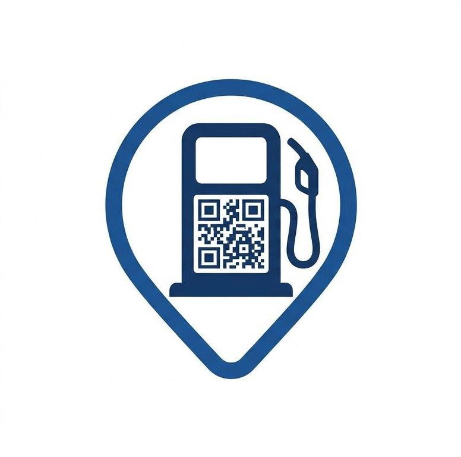

# ⛽ FuelPass LK - Smart Fuel Quota Management

**PUSL2023 - Mobile Application Development Coursework**

<div>
  
</div>

## 📌 Overview

Flutter mobile application for smart fuel quota management in Sri Lanka 🇱🇰
Single app serving three user roles:

🚗 Vehicle Owners
⛽ Fuel Station Attendants
🏛️ Government Administrators


## ✨ Features

**🚗 Vehicle Owner**
- 🚘 Multi-vehicle registration with weekly fuel quotas
- 🗺️ Interactive fuel station map with custom markers and directions
- 📅 Slot booking with date/time selection and availability display
- 💳 Payment flow with card saving and cash option
- 🔳 QR code generation for station verification
- 📊 Real-time quota dashboard with usage tracking

**⛽ Station Attendant**
- 📋 Booking management dashboard with stats and filters
- 📷 QR scanner with validation and litres dispensing
- 🔍 Vehicle lookup for quota verification
- 📍 Geofence alerts when customers approach the station

**🏛️ Government Admin**
- 📈 National fuel distribution analytics
- 🏆 Station performance metrics and rankings
- 🌍 Regional demand heatmap
- 👥 User insights and top customer tracking
- 🌱 Quota forecasting with CO2 emissions estimation

## 📂 Folder Structure

```
fuelq/
├── lib/
│   ├── core/                  # Theme, router, constants, utils
│   ├── features/
│   │   ├── auth/              # Authentication, registration, profile
│   │   ├── booking/           # Slot booking engine
│   │   ├── dashboard/         # Quota dashboard
│   │   ├── map/               # Google Maps station finder
│   │   ├── payment/           # Card and cash payment
│   │   ├── qr/                # QR generation and scanning service
│   │   ├── station_attendant/ # Attendant dashboard, QR scanner
│   │   ├── notifications/     # Geofence alerts, push notifications
│   │   └── analytics/         # Government admin analytics
│   └── shared/                # Reusable widgets
├── assets/                    # Marker icons, images
├── android/                   # Android platform config
```

## 🚀 Quick Start

### ✅ Prerequisites
- Flutter SDK
- Android Studio / VS Code
- Firebase project configured via `flutterfire configure`
- Google Maps API key in `local.properties`

### ⚙️ Setup
```bash
flutter pub get
flutter run
```

### 📦 Build
```bash
flutter build apk
```

## 🤼 The Team

- [@dwainXDL](https://github.com/dwainXDL)
- [@PWTMihisara](https://github.com/PWTMihisara)
- [@drnykteresteinwayne](https://github.com/drnykteresteinwayne)
- [@thiranya123](https://github.com/thiranya123)
- [@Yameeshaa](https://github.com/Yameeshaa)
- [@imanthaisira-beep](https://github.com/imanthaisira-beep)

## 📫 Contact

If you have any feedback or questions, feel free to contact me. [@dwainXDL](https://github.com/dwainXDL)
